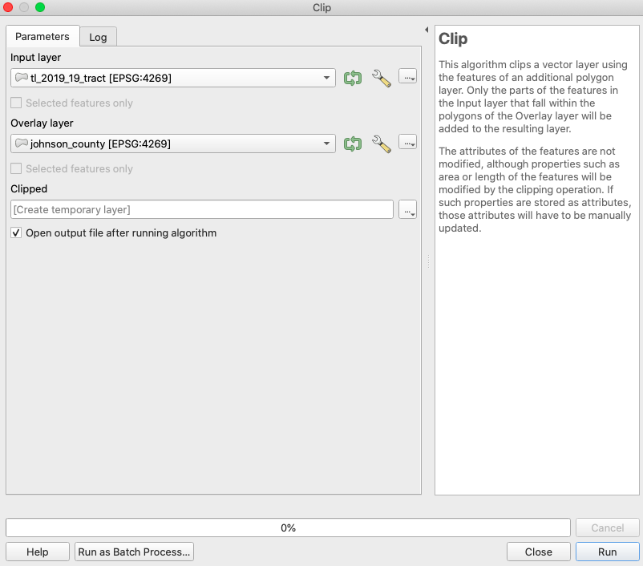

# QGIS for Beginners
Online [tutorials](https://ui-libraries.github.io/QGIS-For-Beginners/) for introductory QGIS

## Contents

- [1: Finding Data and Opening in QGIS](#1-finding-data-and-opening-in-qgis)
  - [Find and Download Data](#find-and-download-data)
  - [Adding Data to the Map Window](#adding-data-to-the-map-window)
  - [Setting the Map Projection](#setting-the-map-projection)
  - [Selecting and Exporting Features Using an Expression](#selecting-and-exporting-features-using-an-expression)
  - [Dissolving a Shapefile](#dissolving-a-shapefile)
  - [Clipping a Shapefile](#clipping-a-shapefile)
  - [Recap](#recap)
- [2: Loading a CSV File, Performing Table Joins to Continuous Shapes, Choropleth Mapping](2-loading-a-csv-file-performing-table-joins-to-continuous-shapes-choropleth-mapping)
  - [Loading Spreadsheet Data in QGIS](#loading-spreadsheet-data-in-qgis)
  - [Joining Attributes by Field Value](#joining-attributes-by-field-value)
  - [Choropleth Mapping](#choropleth-mapping)
- [3: Connecting to a Web Service and Prepping Shapefiles for Analysis](#3-connecting-to-a-web-service-and-prepping-shapefiles-for-analysis)
  - [Connecting to a Web Service](#connecting-to-a-web-service)
  - [Reprojecting a Layer](#reprojecting-a-layer)  
  - [Fixing Geometries](#fixing-geometries)   
- [4: Analyzing How Much of X in Y](#4-analyzing-how-much-of-x-in-y)
  - [Introducing the Python Console](#introducing-the-python-console)
  - [Calculating Polygon Area](#calculating-polygon-area)
  - [Joining Attributes by Field Value (Again)](#joining-attributes-by-field-value-again)
  - [Use Field Calculator to Determine Percent Rec Land for Each Tract](#use-field-calculator-to-determine-percent-rec-land-for-each-tract)
  - [Extra: Saving Data to a CSV to Run Pearson's Correlation Coefficient in Excel](#extra-saving-data-to-a-csv-to-run-pearsons-correlation-coefficient-in-excel)
- [5: Preparing and Exporting a Map in QGIS](#5-preparing-and-exporting-a-map-in-qgis)
  - [Adding a Map to the Print Layout](#adding-a-map-to-the-print-layout)
  - [Adding a Legend](#adding-a-legend)
  - [Adding a Scale Bar](#adding-a-scale-bar)
  - [Thoughts on North Arrows](#thoughts-on-north-arrows)
  - [Adding Text Elements](#adding-text-elements)
  - [Exporting to a PDF](#exporting-to-a-pdf)

## 1: Finding Data and Opening in QGIS
Let’s map life expectancy for census tracts in Iowa. What do we need?

### Find and Download Data
First, navigate to the <a href="https://www.cdc.gov/nchs/nvss/usaleep/usaleep.html#data" target="_blank">CDC website</a> to find life expectancy data by census tract. We could download data for the entire US, but let's scroll down to Iowa and select and download the csv in the second column.

  
**Figure 01**. Download Iowa census tract life expectancy data.

One of the most important aspects of doing GIS is having an organized file structure, so create a folder called "data" inside another folder called "IA-life-expectancy-map" and save your csv as "IA-life-expectancy-data.csv" inside your new data folder. Set the file format to "CSV UTF-8" when saving. Getting into this habit will preserve any special characters and save you headaches in the future.

At this point, you're probably wondering a few things about this spreadsheet. For one, there isn't any explicit geographic data (like coordinates) included in this data. How will you visualize this in a map? This will become clear soon. Just notice that there is a column called "Tract ID" and know that this will be important in the next step.

The first thing you will need to get your data into a map is a census tract shapefile for the State of Iowa. Proceed to the [US Census Bureau's TIGER/Line Shapefiles request form](https://www.census.gov/cgi-bin/geo/shapefiles/index.php). Choose 2019 for the year and "Census Tracts" for the layer type and submit the form.

  
**Figure 02**. Request 2019 census tracts.

Next, you will be prompted to select a state. Choose Iowa and click the download button.

  
**Figure 03**. Request census tracts shapefile for Iowa.

Unzip and place the entire shapefile folder (seven files) into your data folder. Check and make sure your folder structure is as follows:

  
**Figure 04**. Downloaded data within the project folder.

### Adding Data to the Map Window

Now that you have some data, you will want to open up QGIS to see and map your data. Once you have QGIS open, you can add the census tracts shapefile in one of two ways. The easiest way to add it is to drag the file with the ".shp" extension into the map window or table of contents. You will see a warning about transformations. Don't worry about this for now and just click okay. If all goes well, you will see all Iowa census tracts in your map window on a white background.

Now, to practice the other method of adding data, right click on your layer in the table of contents on the left and click "Remove Layer" to clear the map.

  
**Figure 05**. Removing a layer from the map in QGIS.

At the top of the screen, select "Layer" and "Add Layer." You will notice that there are many options corresponding to different types of data. Most important to know is that any sort of shape (point, line, or polygon) is considered vector data. Any sort of scanned data or imagery is considered raster data. Any sort of spreadsheet data falls under delimited text data. Since you have polygon data in the form of census tract boundaries, you will want to choose "Add Vector Layer" as shown below.

  
**Figure 06**. Adding a vector layer to the map in QGIS - 1.

In the dialogue box that follows, locate and choose the census tract shapefile for the vector dataset option under "Source" and click "Add."

  
**Figure 07**. Adding a vector layer to the map in QGIS - 2.

If all goes well, you will see the census tracts of Iowa on a white background. The next thing you will want to do is to establish some geographic context. To do this, you can add a base map under your census tracts shapefile. In the browser window at top left, click "XYZ Tiles" and double click "OpenStreetMap" or drag it into the table of contents. Make sure to drag the base map underneath the census tract layer in the table of contents.

  
**Figure 08**. Adding a base map.

You can also find and experiment with more base maps by going to Plugins -> Manage and Install Plugins and then search for and install QuickMapServices.

### Setting the Map Projection

At this time, you should see your census tracts layered over Iowa on the base map. However, you may notice that the state appears smooshed and a little too horizontally stretched. This is because, you have not set a projection that minimizes distortion over Iowa. Every map requires some amount of distortion as the curved surface of the Earth is projected to the flat surface of a map. The goal is to reduce this distortion as much as possible, so let's find a projection specific to the State of Iowa.

In the bottom righthand corner, you will notice a numeric code after the letters "EPSG." Click on this.

  
**Figure 09**. Locating and changing the projection of your map.

A window will open with an option to filter available projections. Type "Iowa" in this bar and see what is available. Use NAD83(2011) / Iowa South, EPSG:6464. Another good choice is NAD83(2011) / UTM 15N, EPSG:6344. Feel free to experiment.

  
**Figure 10**. Selecting a projection for your map.

After selecting a new projection for your map, you should notice a big improvement in the appearance to something more familiar. Now your map should look more like the image below.

  
**Figure 11**. An appropriate projection for Iowa.

Before moving on, save your progress. Navigate to the bar at the top of the screen and click Project -> Save As and save it as IA-life-expectancy-map.qgz in the root of your IA-life-expectancy-map folder. In the next lesson, you will join your csv data to the census tracts shape file. But, before proceeding to that step, let's get some practice with a few common GIS tools and processes that are necessary to know.

### Selecting and Exporting Features Using an Expression

What if we are only interested in the census tracts in Johnson County? There are a few ways we could isolate these. If you knew exactly where Johnson County was, you could use the select tool and manually highlight only the tracts in Johnson County. However, this method is prone to error. Instead, open the attribute table by right clicking the census tracts layer in your table of contents and clicking "Open Attribute Table." Notice that you have a column called "COUNTYFP." This is the county FIPS (Federal Information Processing Standards) code, and each geographical unit in the country has a unique numeric identifier. So, which number refers to Johnson County?

You can lean on an internet search to find the FIPS code for Johnson County. Doing so, I found this [handy map](https://www.cccarto.com/fipscodes/iowa/). From a quick glance, I can tell that the FIPS code for Johnson County, Iowa is 19103. Actually, it is 103, and 19 refers to the State of Iowa. Armed with this information, return to the census tract attribute table. Notice the button at the top with a small epsilon over a yellow square. Click this.

  
**Figure 12**. Select features using an expression tool.

With this tool open, type "COUNTYFP" = 103 in the expression box. Click "Select Features" at the bottom right and close the tool.

  
**Figure 13**. Select features expression.

Returning to your active map, you should now see all of the census tracts in Johnson County highlighted in yellow. Now, you can export these to a new shapefile. Right click on the census tract layer in the table of contents, click "Export" -> "Save Selected Features As."

  
**Figure 14**. Export selected features.

Now, save the new shapefile as johnson_2019_tracts in your data folder. You will notice there are other format and coordinate reference system options. Under formats, GeoJSON is useful for web map applications written in JavaScript. In the case of CRS options, you may want or need to change these if you are planning on using a measurement including area (population/square mile) and need more accurate values in your attribute table. Feel free to look through these, but just go ahead and use the default settings for now. Click "OK."

  
**Figure 15**. Save selected features.

Check your map again. If you chose to add the exported features to the map, you should see a new shapefile of Johnson County census tracts in your table of contents. If not, drag in the new shapefile from your data folder.

  
**Figure 16**. Johnson County census tracts.

Another way you could extract the Johnson County census tracts is if you had a shapefile for Johnson County. Since you don't, we are going to play with a few tools to build one and use it to extract the census tracts again. Obviously, this is unnecessary to meet our map objectives, but it will expose you to two very important GIS processes: dissolve and clip.

### Dissolving a Shapefile

Dissolving a shapefile will collapse all internal features of a shapefile so that you are left with one large polygon. To get a sense of the tools available to you through QGIS, click "Processing" -> "Toolbox" in the bar at the top of the screen. In the search bar at the top, type "dissolve" and click on the tool called "Dissolve" under "Vector geometry."

  
**Figure 17**. Locating the Dissolve tool.

Use the johnson_2019_tracts.shp as the input layer, leave dissolve fields empty (more on this in a bit), and save the output to a new shapefile in your data folder called "johnson_county." Press "Run" and check your map window. You should now see a single polygon for Johnson County.

  
**Figure 18**. Dissolve tool setup - 1.

You might have wondered what you can do with the dissolve fields in the Dissolve tool. This feature would be really helpful if you wanted a shapefile of Iowa counties, but did not want to scour the internet and download a totally new shapefile.

Open the Dissolve tool once again. This time, use the statewide census tracts shapefile as the input layer. Now, designate "COUNTYFP" as the dissolve field. This will find any features that share a value for "COUNTYFP" and collapse them into polygons for each unique value. Then, save the output as a shapefile in your data folder called "iowa_counties" and press "Run."

  
**Figure 19**. Dissolve tool setup - 2.

If you return to your map window, you can see that this process output a new shapefile of all of Iowa's 99 counties by dissolving each census tract into its encompassing county.

  
**Figure 20**. Iowa's 99 counties.

### Clipping a Shapefile

Now that you know some of the convenient functions available to you through the Dissolve tool. Let's take a look at the Clip tool. This tool is also referred to as the cookie cutter tool because you use the outline of a smaller shapefile to cut out the contents of a larger shapefile. In this case, you can use your Johnson County shapefile to cut out the Johnson County census tracts from the statewide census tract shapefile.

First, search for "Clip" in the processing toolbox search bar and choose the Clip tool listed under "Vector overlay." In the tool's dialogue box, designate the statewide census tracts as the input layer and the Johnson County shapefile as the overlay layer. Since we already have the census tracts for Johnson County, just leave the default setting of "Create temporary layer" as it is. For this example, you just want to see the result to understand how this tool works. Click "Run" and check your map window upon completion.

  
**Figure 21**. Clip tool settings.

Now, if you check your map window and zoom into Johnson County, you will see that this tool used your Johnson County shapefile and your statewide census tract shapefile to return a new shapefile of only the census tracts within your Johnson County shapefile.

  
**Figure 22**. Johnson County census tracts clip.

Once again, save your project over your old qgz file in the root of your project folder.

### Recap

In this lesson, you learned a few of the most important aspects of using GIS to visualize and manipulate your data. You saw how reliable data is freely available on the internet for download and use. You learned different ways to load a shapefile into an active map edit session with QGIS. You learned how to remove layers from the edit session. You saw how to add a base map for spatial context. Next, you found out how to set an appropriate projection for your map project. After this, you learned how to select features using an expression and how to export these features to a new shapefile. Finally, you learned about dissolving features to create new shapefiles for Johnson County and all the counties in Iowa. When you are ready, proceed to the next lesson!

## 2: Loading a CSV File, Performing Table Joins to Continuous Shapes, Choropleth Mapping

Last time, you downloaded some spreadsheet data on life expectancy by Iowa census tract, but we did not load this data in QGIS.

### Loading Spreadsheet Data in QGIS

Open your QGIS map project. If you double-click your qgz file, it should automatically open in QGIS, but you can also drag it into an empty map window in QGIS. Now, navigate to the bar at the top and select "Layer" -> "Add Layer" -> "Add Delimited Text Layer." In the window that opens, select your IA-life-expectancy.csv file from your data folder. Also, make sure to select "No geometry" under "Geometry Definition" as this spreadsheet contains no coordinates. Click "Add."

  
**Figure 23**. Adding CSV data.

You will now see the spreadsheet included in your table of contents. Right click on it and open the attribute table. Notice that the numeric entries in the column called "Tract ID" look just like those in the census tract shapefile called "GEOID." We can join the spreadsheet data to the shapefile based on these shared data.

### Joining Attributes by Field Value

Like last time, open up the processing toolbox ("Processing" -> "Toolbox"), search for the tool called "Join attributes by field value," and open. Use the census tracts shapefile as your input layer and select "GEOID" for "Table field." Next, select the life expectancy spreadsheet for the second input layer and choose "Tract ID" for the second table field. We only want to add the life expectancy data, so select "e(0)"" for "Layer 2 fields to copy." Save the output shapefile as "IA_tracts_life_expectancy_2019" to your data folder and click "Run."

  
**Figure 24**. Join tool settings.

After you run this tool, you will notice that several features failed to join. This is because there are a few census tracts for which data are unavailable. This is unfortunate, but sometimes you just need to understand that there are limitations to your data. On the bright side, we now have quantitative data allowing us to make a beautiful color-coded map of life expectancy across Iowa.

### Choropleth Mapping

Mapping with color buckets is called choropleth mapping. That's not a typo, and those in the know will never cease to be bothered by newbies calling it "chloropleth mapping," so don't make that mistake!

To begin, right click your IA_tracts_life_expectancy_2019 layer in the table of contents and click "Properties." In the "Symbology" option, you will see that it is currently set to "Single symbol." Change this to "Graduated." For "Value," select "e(0)" and then select "Natural Breaks (Jenks)" for "Mode" with 5 classes. Now click "Classify," "Apply," and "OK."

  
**Figure 25**. Initial choropleth settings.

Returning to the map window, you will now see all of the census tracts color coded base on their average life expectancy values. However, this color scheme is a little confusing. A good map maker needs to think about the audience, and many people associate a darker shade of red with a more negative value. Considering this, we should invert our color scheme or change the color palette. Let's try inverting.

Go back to the layer properties window. Choose the dropdown option to the right of "Color ramp" and select "Invert." Click "Apply" and "OK."

  
**Figure 26**. Invert choropleth settings.

Hmm... the output is still not great. While this is a matter of opinion, my thoughts are that a single red color scale makes everything look negative and does not really convey a sense of difference around a larger average. For data regarding averages, it is probably a good idea to go with a divergent color scale around a neutral middle color. Try reclassifying with the RdYlGn scale.

  
**Figure 27**. Set to RdYlGn choropleth scale.

This looks a little more intuitive to me. The tracts with the lowest life expectancies are now dark red, while those with the highest life expectancies are dark green. This seems more consistent with the reflexive associations people make with those colors. Unfortunately, this is still not an ideal choice. What if you were enrolled in a map design competition and the judge was color blind? Even if we're making a map for a presentation or article, we should always try to be as inclusive as possible when designing for a wide audience. Is there any way we can adjust our map for color blindness?

  
**Figure 28**. The map using the RdYlGn scale.

Fortunately, QGIS has a preview option that simulates color blindness. From the bar at the top of the screen, click "View" -> "Preview Mode" to see all of the available preview options to simulate different types of color loss. Notice that the RdYlGn scale doesn't work so well when filtered through the two color blindness simulations.

  
**Figure 29**. Simulating color blindness.

Instead, try using the RdBu scale. If you preview with the color blindness simulations, you will notice that these color differences are perceptible to someone with color blindness. Your map should now look like the one below.

  
**Figure 30**. Final color scheme.

This is looking good, but you might be wondering if you can make these colors somewhat transparent so that you can see the features of the base map beneath the styled census tracts layer.

Again, right click on your choropleth life expectancy layer and open the properties options. At the bottom of the window, you should see a dropdown arrow next to an option called "Layer Rendering." Click this and make note of the interactive opacity scale bar. Slide this down to 70% and click "Apply" and "OK."

  
**Figure 31**. Changing the layer opacity.

Return to your active map edit window and notice the difference. You can now see the names of the communities and the road networks of the base map through the newly styled life expectancy layer. This is looking good, and you have made a lot of progress, so save these edits to your qgz file in the root of your project folder. For the time being, let's turn to something a little different to build up your GIS skill set. Keep your map project open and turn off all layers except the life expectancy census tract layer in your table of contents.

## 3: Connecting to a Web Service and Prepping Shapefiles for Analysis

Let's say we were interested in researching the correlation between recreational opportunities and life expectancy by census tract. Obviously, to claim any sort of possible causality, we would need a lot more research to withstand scrutiny. However, a map like this can provide a nice visual for conveying your thesis or findings to a wider audience. For this lesson, we will calculate the percentage of land devoted to recreational areas for each census tract so that we can compare this to the average life expectancy for each tract.

### Connecting to a Web Service

Instead of downloading data to our desktop, we can link QGIS to a server on the web that hosts the public recreational land data we need. Using web services to access GIS data is a nice and convenient way to work with open source data in QGIS. First, navigate to the Iowa DNR's [Recreation Atlas Web Service](https://iowadnr.maps.arcgis.com/home/item.html?id=c9a5551044a84ff6bf2fde343b9dac07). In the lower right corner of this page, you will notice a url that you can copy. For convenience, the url you need to copy is: https://programs.iowadnr.gov/geospatial/rest/services/Recreation/Recreation2020/MapServer.

You may have noticed that the Recreation Atlas Web Service is an ArcGIS service. That's fine, QGIS can handle this. From the options in the top bar, choose "Layer" -> "Add Layer" -> "Add ArcGIS FeatureServer Layer" as shown in the screenshot below.

  
**Figure 32**. Selecting the Add ArcGIS FeatureServer Layer option.

In the dialogue box that opens, click the "New" button under "Server Connections." Name this connection "Iowa Rec Land" and paste the copied url (https://programs.iowadnr.gov/geospatial/rest/services/Recreation/Recreation2020/MapServer) into the URL box. Click "OK."

  
**Figure 33**. Connecting an Add ArcGIS FeatureServer Layer.

Now, in the browser window, scroll down to "ArcGisFeatureServer" and maximize its contents. You should see "Iowa Rec Land" there, so you can go ahead and maximize this as well. Scroll down to "Public Areas" and drag and drop this into your map.

  
**Figure 34**. Finding the feature service in the browser window.

You should now see splotches of green across your Iowa map representing all of the public parks and recreation areas in the state. We are almost ready to conduct our analysis, but there is some data prep we need to complete first.

### Reprojecting a Layer

In order to obtain accurate relative measurements for both the census tract and recreational area polygons, both layers should be in the same projection. By checking the layer properties of the "Public Areas" layer, you will notice that it is projected to UTM 15N, or EPSG 26915. That is one of a few good projections for Iowa, so go ahead and project the "IA_tracts_life_expectancy_2019" layer to that projection. To do this, choose "Processing" -> "Toolbox" and search for the tool called "Reproject layer" under "Vector general." Upon opening this tool, set up the dialogue box as follows:

  
**Figure 35**. Reproject layer.

As shown, make sure to set the input layer to "IA_tracts_life_expectancy_2019" and the target CRS to EPSG 26915. Next, save the output to your project data folder as a shapefile and call it "IA_tracts_life_expectancy_2019_UTM15N." Finally, deselect "Open output file after running algorithm" and click "Run." After the tool runs, drag the reprojected shp from your data folder into your map window. Also, just for consistency, change the projection of the project to EPSG 26915 by clicking the EPSG button at the bottom righthand corner of the map window and entering "EPSG 26915" in the search bar.

### Fixing Geometries

To save you some time banging your head against the monitor, know that if you try to run an intersection on your "Public Areas" and new "IA_tracts_life_expectancy_2019_UTM15N" layer, it will fail due to invalid geometries in the Public Areas layer. To prevent this, you need to run another tool on the "Public Areas" file called "Fix geometries."

  
**Figure 36**. Fix geometries.

Find this tool the same way you found the last one and open it. Set the input layer to the "Public Areas" file and save the output as a shapefile named "Public_Areas_fixed" in your data folder. Also, uncheck "Open output file after running algorithm" and click "OK." Now, you can drag and drop the new "Public_Areas_fixed.shp" shapefile into your map window or table of contents. You may notice your table of contents filling up, and it may be getting a little confusing to differentiate between your layers. Go ahead and remove all layers from your table of contents, except "Public_Areas_fixed" and "IA_tracts_life_expectancy_2019_UTM15N." Save your project to your qgz file in the root of your project folder. At this point, your map should look something like the one below.

  
**Figure 37**. Census tracts and public recreational lands.

## 4: Analyzing How Much of X in Y

You may have noticed that it was sort of a pain to run multiple tools individually, and you may be wondering if there is some way to program all of these tools to run automatically in succession. There is, but you will need to get comfortable with using some Python in the built-in Python Console. Python is a programming language, and the Python library you will need to use for data processing in QGIS is baked into the software.

### Introducing the Python Console

To open the Python Console in QGIS, click "Plugins" -> "Python Console." At the bottom of the screen, notice that two windows have opened. The top window is the console, which will give you clues to help you debug if a script fails. The bottom window is your scripting window, where you will type and enter commands. In this bottom window, type:

```python
print("I'm using Python")
```

If you press the return key, you should notice that "I'm using Python" has logged to the console window. Now for something more exciting. Click the little button that looks like a pen over a notepad and type the following into the editor window that opens (I have commented out explanations alongside the code). Make sure that you update any file paths in the following scripts to refer to the files on your own computer, rather than mine.

```python
publicAreasFile = "/Users/jaybowen/Desktop/IA-life-expectancy-map/data/Public_Areas_fixed.shp" # Define the source of your data with the path to your Public_Areas_fixed shapefile.
publicAreasLayer = QgsVectorLayer(publicAreasFile, '', 'ogr') # QgsVectorLayer(data_source, layer_name, provider_name)
for field in publicAreasLayer.fields(): # For each field in the layer...
    print(field.name()) # print the name of the field.
```

Press the run script button, which looks like a green triangle or play button. Notice that the console window now displays all of the fields in the "Public_Areas_fixed" attribute table. You have access to this file for any [spells](https://docs.qgis.org/testing/en/docs/user_manual/processing_algs/qgis/index.html) you wish to cast on it!

  
**Figure 38**. Casting spells with Python.

Now, continuing to add to this script, do the same thing with your "IA_tracts_life_expectancy_2019_UTM15N" layer.

```python
publicAreasFile = "/Users/jaybowen/Desktop/IA-life-expectancy-map/data/Public_Areas_fixed.shp" # Define the source of your data with the path to your Public_Areas_fixed shapefile.
publicAreasLayer = QgsVectorLayer(publicAreasFile, '', 'ogr') # QgsVectorLayer(data_source, layer_name, provider_name)

tractsLEFile = "/Users/jaybowen/Desktop/IA-life-expectancy-map/data/IA_tracts_life_expectancy_2019_UTM15N.shp" # Define the source of your data with the path to your IA_tracts_life_expectancy_2019_UTM15N shapefile.
tractsLELayer = QgsVectorLayer(tractsLEFile, '', 'ogr') # QgsVectorLayer(data_source, layer_name, provider_name)

for field in tractsLELayer.fields(): # For each field in the layer...
    print(field.name()) # print the name of the field.
```

Notice that, when you click the run button, you now see the fields from the attribute table of your tracts layer.

  
**Figure 39**. Reading field names with Python.

So you have possession of your shapefiles in the Python console. Time to run some tools!

First, delete the code starting with "for field in" and replace this with:

```python
processing.run('qgis:intersection', {'INPUT' : tractsLELayer, 'OVERLAY' : publicAreasLayer, 'OUTPUT' : "/Users/jaybowen/Desktop/IA-life-expectancy-map/data/Intersect_Test.shp"})
```

so that your entire script now looks like the following...

```python
publicAreasFile = "/Users/jaybowen/Desktop/IA-life-expectancy-map/data/Public_Areas_fixed.shp" # Define the source of your data with the path to your Public_Areas_fixed shapefile.
publicAreasLayer = QgsVectorLayer(publicAreasFile, '', 'ogr') # QgsVectorLayer(data_source, layer_name, provider_name)

tractsLEFile = "/Users/jaybowen/Desktop/IA-life-expectancy-map/data/IA_tracts_life_expectancy_2019_UTM15N.shp" # Define the source of your data with the path to your IA_tracts_life_expectancy_2019_UTM15N shapefile.
tractsLELayer = QgsVectorLayer(tractsLEFile, '', 'ogr') # QgsVectorLayer(data_source, layer_name, provider_name)

processing.run('qgis:intersection', {'INPUT' : tractsLELayer, 'OVERLAY' : publicAreasLayer, 'OUTPUT' : "/Users/jaybowen/Desktop/IA-life-expectancy-map/data/rec_tract_intersect.shp"}) # This runs the intersection tool with your tracts and public rec layers as the inputs and designates a new file called "rec_tract_intersect.shp" to be output to your data folder
```

Before you press run, add another script to dissolve the output of the intersection by census tract.

```python
publicAreasFile = "/Users/jaybowen/Desktop/IA-life-expectancy-map/data/Public_Areas_fixed.shp" # Define the source of your data with the path to your Public_Areas_fixed shapefile.
publicAreasLayer = QgsVectorLayer(publicAreasFile, '', 'ogr') # QgsVectorLayer(data_source, layer_name, provider_name)

tractsLEFile = "/Users/jaybowen/Desktop/IA-life-expectancy-map/data/IA_tracts_life_expectancy_2019_UTM15N.shp" # Define the source of your data with the path to your IA_tracts_life_expectancy_2019_UTM15N shapefile.
tractsLELayer = QgsVectorLayer(tractsLEFile, '', 'ogr') # QgsVectorLayer(data_source, layer_name, provider_name)

processing.run('qgis:intersection', {'INPUT' : tractsLELayer, 'OVERLAY' : publicAreasLayer, 'OUTPUT' : "/Users/jaybowen/Desktop/IA-life-expectancy-map/data/rec_tract_intersect.shp"}) # This runs the intersection tool with your tracts and public rec layers as the inputs and designates a new file called "rec_tract_intersect.shp" to be output to your data folder

processing.run('qgis:dissolve', {'INPUT' : "/Users/jaybowen/Desktop/IA-life-expectancy-map/data/rec_tract_intersect.shp", 'FIELD' : "GEOID", 'OUTPUT' : "/Users/jaybowen/Desktop/IA-life-expectancy-map/data/rec_tract_intersect_dissolve.shp"}) # This runs the dissolve tool on your new "rec_tract_intersect.shp" file using GEOID (the complete unique census tract number) as the dissolve field and outputs "rec_tract_intersect_dissolve.shp" your data folder.
```

Notice that you can simply use the file path as your input for running these processing tools. This is good to know if you are just running tools and not trying to parse data from your shapefiles. Once again, make sure that the paths in your script refer to file paths on your computer rather than mine. Now, press the "Run Script" button.

If you check your project data folder, you will now see two new shapefiles: "rec_tract_intersect.shp" and "rec_tract_intersect_dissolve.shp." The nice thing about doing it this way is that you were able to perform two processes rapidly without having to open a dialogue box. You just automated a workflow! While it would be more advanced python scripting to make a GUI to handle this, you could imagine how you might develop an intersect-dissolve tool that could exchange your hard-coded inputs for user inputs, saving you and others tons of time. Make sure to click the "Save As" button in the Python Console and save your python script as "intersect-dissolve.py" in the root of your project folder. This will be a good future reference if you want to dive into more python scripting later.

Just to make sure everything is good, drag "rec_tract_intersect_dissolve.shp" into your map window and open the attribute table. Notice that all of the public recreational land is now dissolved by its encompassing census tract. We could continue working in Python, but let's take a break. It's good to become accustomed to scripting in small steps and know that, going forward, you could probably figure out Python scripting for QGIS or ArcGIS if you had to.

  
**Figure 40**. Result of Python script.

### Calculating Polygon Area

If you look inside the project properties, you will notice that the units of measurement are in meters. So, unless we convert, the areas we calculate for the polygons of both layers will be in square meters. This is fine, since our final figures will the percentages of each census tract devoted to recreational land.

First, open the attribute table for "rec_tract_intersect_dissolve" and click the abacus logo at the top. This opens the Field Calculator. In the Field Calculator window, check "Create a new field" and call it "rec_area." In the expression box, type "$area" and click "OK."

  
**Figure 41**. Using Field Calculator to calculate the area of recreational land in square meters.

Returning to the attribute table, you will now see a new column with the area of each polygon in square meters. Go ahead and do this for the "IA_tracts_life_expectancy_2019_UTM15N" layer, but call this additional field "tract_area" to emphasize that it is the area of the entire tract.

If you look at both layers in the table of contents, you might notice that there is a pencil over them. This means they are in edit mode, because we ran the Field Calculator on them. Right click them and click "Toggle Editing" to turn off edit mode. If you are prompted to save your edits, do so. Now we need to join the rec_area column from the "rec_tract_intersect_dissolve" layer to the "IA_tracts_life_expectancy_2019_UTM15N" layer attribute table.

### Joining Attributes by Field Value (Again)

From the top bar, select "Processing" -> "Toolbox" and type "join attributes by field value" in the search bar. Open the tool and fill out the dialogue box as follows:

  
**Figure 42**. Add recreational land area to census tracts shapefile.

Notice this time that, under "Layer 2 fields to copy," it says there is one element selected. That is because I have selected only the "rec_area" field to copy over. If you leave this blank, it will copy over every attribute from the second layer. You don't want that! Also notice that you should save the output to a new shapefile in your data folder called "Rec_Land_per_Tract." Additionally, uncheck "Open output file after running algorithm." Now, click "OK." You may have noticed that 174 features could not be matched. This is because some census tracts do not contain any public recreational land. Drag the new shapefile into the map from your data folder. Open the attribute table of "Rec_Land_per_Tract." You should notice, side by side, "tract_area" and "rec_area."

### Use Field Calculator to Determine Percent Rec Land for Each Tract

With the "Rec_Land_per_Tract" attribute table open, click the Field Calculator button (the abacus icon). The first thing you need to do is to take care of the null values in the rec_area column. These occurred because some census tracts do not contain any public recreational land. Therefore, we can change these values to 0. In Field Calculator, click "Update existing field" and select "rec_area." In the expression box, type 'if("rec_area" is null, 0, "rec_area")' and click "OK."

  
**Figure 43**. Convert null rec area values to zero.

Check your attribute table to make sure everything looks good and reopen Field Calculator to calculate the percentage of each census tract devoted to public recreational space. This time, click "Create new field" and call it "perc_rec." In the expression box, type '("rec_area"/"tract_area")*100' and click "OK."

  
**Figure 44**. Calculate percent of each census tract devoted to recreational land.

If all goes well, you should now see in your attribute table that 66 is the highest value for the "perc_rec" column. Finally, style your "Rec_Land_per_Tract" and "IA_tracts_life_expectancy_2019_UTM15N" layers by accessing the layer properties as before, setting the transparency to 70% for both. The result should look like the following:

  
**Figure 45**. Visualizing life expectancy and percent recreational land by census tract.

From just a glance, I don't see too much of a correlation between the two measurements. If we wanted, we could run Pearson's r on the numbers and find out for sure. For now, save your project to its qgz file as usual.

### Extra: Saving Data to a CSV to Run Pearson's Correlation Coefficient in Excel

As mentioned, you may want to test your spatial stats for correlation. Remember, correlation does not equal causation, so this analysis should always be part of a larger rigorous study to determine a potential causative link. At the moment, I can think of several socioeconomic variables that are probably much more indicative of low life expectancy (poverty rate, percent of population uninsured or underinsured, smoking rates, OSHA regulation violations, and infant mortality to name a few). Still, it is never a loss to be able to prove the null hypothesis, so let's see what we find by comparing census tract life expectancy to recreational land coverage.

  
**Figure 46**. Exporting a shapefile to a CSV file.

Right click "Rec_Land_per_Tract" in the table of contents and click "Export" -> "Save Features As..." and choose CSV for format. Save the file as "Rec_Land_per_Tract.csv" in your data folder, set encoding to UTF-8, set geometry type to no geometry, uncheck "Add saved file to map," and click "OK." Now, go to your data folder and open the exported CSV file in Excel. In Excel, you can easily measure correlation by selecting a new cell and typing "=PEARSON(M2:M826,P2:P826)" where M2:M826 is the life expectancy column and P2:P826 is the percent recreational land column. Upon pressing return, you should see -0.044324811 as the Pearson's r value.

  
**Figure 47**. Calculating Pearson's r in Excel.

Strong correlation is a number close to 1 or -1, so this value proves there is little to no correlation statewide between life expectancy and percent of land devoted to recreation. This is not to say there is no correlation at some other scale. For example, if you were very interested in this topic, you may wish to see if there is any correlation when testing for urban census tracts alone, as it is likely that access to recreational land matters relatively less in rural areas where most people are close to outdoor activities by default. Save your data and progress.

## 5: Preparing and Exporting a Map in QGIS

So how do you prepare a map for inclusion in a publication or presentation? First, you need to set up your map edit screen so that only the layers you want to appear in the final map are visible. Also, you will want to make sure you have styled your map layers appropriately. For this exercise, you will finalize a map of life expectancy by census tract for the State of Iowa, so go ahead and remove all layers (but leave the base map!) except for "IA_tracts_life_expectancy_2019_UTM15N" so that your map edit window looks like this:

  
**Figure 48**. Preparing for finalization.

### Adding a Map to the Print Layout

Now, save your map project to the qgz file and click "Project" -> "New Print Layout" from the bar at the top. You can also press command + P on your keyboard. You will be prompted to enter a title. Call it "Iowa Tracts Life Expectancy" and click "OK." A new window will open over your edit session. On the lefthand side of the screen, you will see a series of buttons. As you hover over them, you will see the names of each function appear in a tag. Find and click the one that says "Adds a new Map to the layout."

  
**Figure 49**. Click to add a map to the layout.

Now, click anywhere on the print layout, drag, and release. You can move and resize as you add more elements, so just get the map on there for starters. Also, click "Save."

  
**Figure 50**. Map added to layout.

### Adding a Legend

Good, but you are going to need a legend so that people can make sense of the data. Again, hover over the buttons on the lefthand side until you see the "Adds a new Legend to the layout" tab. Click this and, just like you did with the map, click the print layout, drag, and release. You will notice that the legend looks pretty bad. The good thing is that you can rework it.

In the bar, on the righthand side of the screen, click "Item Properties," scroll down to "Legend Items," and double click the header/title. You can edit this to say, "Average Life Expectancy." Also, click on each numeric range and delete all those unnecessary zeroes. Finally, click on the OpenStreetMap base map title and delete it. Now, scroll down and click the box next to "Frame" to give the legend a border. Now, scroll up and uncheck "Resize to fit contents" and notice how you can now resize the legend manually. Save your progress. The result should look something like this:

  
**Figure 51**. Map and legend.

### Adding a Scale Bar

Now, just as you have done with the map and legend, find the button to add the scale bar and add that to the map. Place the scale bar in the lower left corner, opposite to the legend. When making a map, you want to balance the content as much as possible. Notice that the units of the scale bar are in kilometers. This would be perfect for international journals, but for US audiences, you may want to change this to miles. If you go back to "Item Properties" on the right, you will notice dropdown options for scale bar units. Change this to miles. Also, your scale bar might not be very wide. Go to "Segment" and set it to "right 4." Now, your scale bar should go up to 100 miles. Save and continue.

  
**Figure 52**. Customizing the scale bar.

### Thoughts on North Arrows

You may want a north arrow. My opinion on north bars is to use them when deviating from the standard practice of setting the top of the map as north. In all other circumstances, they just add clutter. However, if you just can't do without one, you should add it to the upper right corner of your map, keep it small, and use a subtle icon. The process for doing this is the same as adding a scale bar. Simply find the appropriate button on the left and add.

### Adding Text Elements

The next necessary element is a title. Click "Adds a new Label to the layout" and click and drag a wide box across the white space above the map. Now, move over to "Item Properties" and edit the text inside the box, which says, "Lorem ipsum." Change this to "Average Life Expectancy by Census Tract, Iowa" and click the "Font" dropdown menu under "Appearance." Choose Arial Regular 36 as shown below. Save your progress.


**Figure 53**. Adding a title.

Now, you need to add a byline. Again, click "Adds a new Label to the layout" and add a text box just below the title following the same steps listed above. This time, change the text to "By <Your Name>, <Your Credentials and Organization>, <The Current Year>" and select Arial Regular 15 for your font settings. Save your progress.


**Figure 54**. Adding a byline.

Finally, you need to add references and other details. Add another label in the white space underneath the map in the bottom left corner. In the text box, replace the default text with:

Credits:
Life expectancy data courtesy of the CDC, https://www.cdc.gov/nchs/nvss/usaleep/usaleep.html#data
Census tract polygons courtesy of the US Census Bureau, https://www.census.gov/cgi-bin/geo/shapefiles/index.php
Map Projection:
NAD83 / UTM zone 15N, EPSG 26915

Set the font to Arial Regular 10 and the horizontal alignment to left. Readjust your map elements so that your print layout looks like that below. Save your progress.


**Figure 55**. Final print layout.

### Exporting to a PDF

Hover over the buttons at the top of the print layout window until you see a tag for "Export as PDF..." and click.


**Figure 56**. Exporting to a PDF.

Before clicking "Save," title your PDF "Iowa_Tracts_Life_Expectancy.pdf" and make sure the path is to your project folder. In the PDF Export Options box that appears next, simply click "Save." Now, if you go to your project folder and open the exported PDF document, you will see a beautiful finalized map, which you can add to any number of documents for publication or presentation.


**Figure 57**. The final product.

Congratulations! I hope you learned a lot about using QGIS for mapmaking, and I hope that this document proves to be a helpful reference in the future. Until then, take a big breath and pat yourself on the back. You covered a lot of ground!
